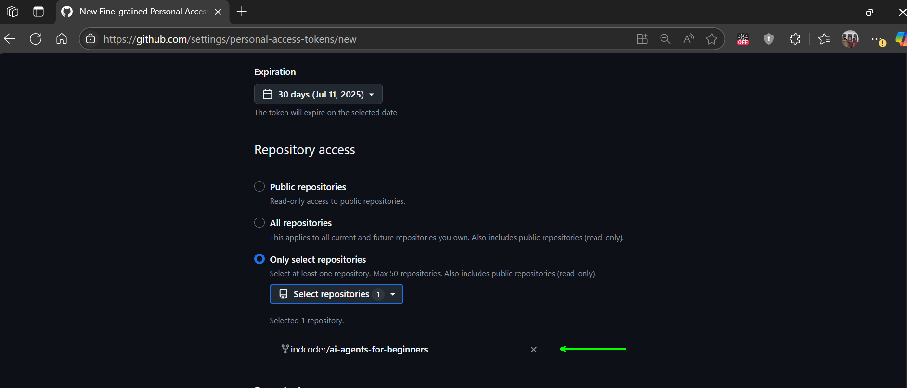

# Course Setup

## Introduction

This lesson covers how to run the code samples of this course. Every lesson
uses the same setup: Python 3.12, one `pip install`, and a `.env` file that
points at an OpenAI-compatible model endpoint. No cloud account other than the
model provider is needed.

## Clone or Fork this Repo

To begin, clone or fork the GitHub repository. Forking gives you your own copy
where you can experiment freely.

Click the **fork** button on the repository page, then select the repository
you would like to fork to:



## Requirements

- Python 3.12 or newer
- An API key for an OpenAI-compatible endpoint that supports tool calling
  (the default configuration uses [DeepSeek](https://platform.deepseek.com/))
- Node.js LTS for lessons 11 (the github-mcp app) and 17 (both launch MCP servers with `npx`)

## Setup

### Step 1: Create a virtual environment and install dependencies

```bash
python3 -m venv .venv
# Windows: py -3.12 -m venv .venv
source .venv/bin/activate          # Windows PowerShell: .venv\Scripts\Activate.ps1
# If PowerShell reports that scripts are disabled, run `Set-ExecutionPolicy -Scope CurrentUser RemoteSigned` once,
# or use `.venv\Scripts\activate.bat` from cmd.
pip install -r requirements.txt
```

### Step 2: Create your `.env` file

```bash
cp .env.example .env               # Windows PowerShell: Copy-Item .env.example .env
```

Open `.env` and fill in the four required values:

```text
LLM_BASE_URL="https://api.deepseek.com/v1"
LLM_API_KEY="sk-..."
LLM_MODEL="deepseek-v4-pro"
LLM_EXTRA_BODY='{"thinking": {"type": "disabled"}}'
```

`LLM_EXTRA_BODY` is a JSON object sent with every request; DeepSeek's thinking
models reject the forced tool calls that structured output needs, so it turns
thinking off (clear it for providers that reject unknown fields).

`.env` is listed in `.gitignore`, so your key stays on your machine.

### Step 3: Check your endpoint

```bash
python scripts/check_endpoint.py
```

The script sends four tiny requests (three when `VISION_MODEL` is empty) and prints a table like this:

```text
Endpoint: https://api.deepseek.com/v1
Model:    deepseek-v4-pro

capability  result    used by lessons
chat        PASS      all lessons
tools       PASS      01, 03-05, 07-13, 16-18 (create_agent needs tool calling)
structured  PASS      03, 07, 08 (structured output forces a tool call; DeepSeek thinking models need LLM_EXTRA_BODY to disable thinking)
vision      PASS      10 (expense demo), 15 (browser-use) — optional, set VISION_* to enable

Ready: this endpoint supports everything the course requires.
```

`chat` and `tools` must pass. If `tools` fails, the model does not support
function calling; choose another model. If only `structured` fails, the script
prints a hint: on DeepSeek, set `LLM_EXTRA_BODY` as shown in Step 2.

### Step 4: Run a notebook

```bash
jupyter notebook
```

Open `01-intro-to-ai-agents/code_samples/01-python-langchain-agent.ipynb` and
run the cells from top to bottom. Every notebook starts with the same cell that
loads `.env` and builds the model client:

```python
import json
import os
from dotenv import load_dotenv, find_dotenv
from langchain_openai import ChatOpenAI

load_dotenv(find_dotenv())
llm = ChatOpenAI(
    model=os.environ["LLM_MODEL"],
    base_url=os.environ["LLM_BASE_URL"],
    api_key=os.environ["LLM_API_KEY"],
    extra_body=json.loads(os.environ.get("LLM_EXTRA_BODY") or "null"),
)
```

## Using a different model provider

Any endpoint that implements the OpenAI Chat Completions API with tool calling
works. Change the `LLM_*` values:

| Provider | `LLM_BASE_URL` | Example `LLM_MODEL` | `LLM_EXTRA_BODY` | Notes |
|---|---|---|---|---|
| DeepSeek (default) | `https://api.deepseek.com/v1` | `deepseek-v4-pro` | Set as shown above | Also serves the vision model used by lessons 10 and 15. |
| OpenAI | `https://api.openai.com/v1` | `gpt-5-mini` | Clear it | Also usable as the `VISION_*` endpoint. |
| MiniMax | `https://api.minimax.io/v1` | `MiniMax-M3` | Clear it | Large context window. |
| Ollama (local) | `http://localhost:11434/v1` | `qwen3:8b` | Clear it | Set `LLM_API_KEY="ollama"`. Multi-agent lessons work best with 7B+ models. |
| vLLM (self-hosted) | `http://localhost:8000/v1` | your served model name | Clear it | Any tool-calling model. |
| Zhipu GLM | `https://open.bigmodel.cn/api/paas/v4` | `glm-5.3-flash` | Clear it | Clear `LLM_EXTRA_BODY`; `glm-4.5v` works as `VISION_MODEL`. |

Run `python scripts/check_endpoint.py` again after switching.

### Optional: vision model for lessons 10 and 15

Lesson 10's expense demo reads a receipt image and lesson 15 drives a browser
with screenshots. DeepSeek serves `deepseek-v4-flash-vision-exp` on the same
endpoint, so the `VISION_*` defaults in `.env.example` enable both with no
extra key (`VISION_API_KEY` empty reuses `LLM_API_KEY`). Any other endpoint
with image input works too:

```text
VISION_BASE_URL="https://api.openai.com/v1"
VISION_API_KEY="sk-..."
VISION_MODEL="gpt-5-mini"
```

To run those lessons on their text-only path instead, clear `VISION_MODEL`.

### Optional: local model for lesson 17

Lesson 17 builds an agent that runs entirely on your machine with
[Ollama](https://ollama.com/). Install Ollama, then:

```bash
ollama pull qwen3:8b
ollama serve      # skip this if Ollama already runs as a background service
```

`LOCAL_LLM_BASE_URL` and `LOCAL_LLM_MODEL` in `.env` already point at the
default Ollama port and this model. On a machine with less than 8 GB of free
RAM, pull `qwen3:1.7b` instead and set `LOCAL_LLM_MODEL` to match.

### Optional: browser for lesson 15

```bash
pip install browser-use playwright
playwright install chromium
```

## Vector search

Lessons 05, 11, 16 and 17 use [Chroma](https://www.trychroma.com/) as a local
vector store. It runs in-process and needs no server or embedding API. See
[vector-search-setup.md](./vector-search-setup.md) for a two-minute
introduction.

## Setup VS Code

Install the Python and Jupyter extensions, open the repository folder, and
select the `.venv` interpreter (**Python: Select Interpreter**). Notebooks then
run inside VS Code with the same `.env`.

## Troubleshooting

### `tools FAIL` from `check_endpoint.py`

The model does not support function calling. Pick a model that does (every
provider in the table above lists one).

### `401 Unauthorized`

The key in `.env` is wrong or belongs to a different provider than
`LLM_BASE_URL`. Check both values match.

### SSL certificate verification errors on macOS

If you installed Python from python.org and see `SSL: CERTIFICATE_VERIFY_FAILED`,
run the certificate installer that ships with Python:

```bash
# Replace 3.XX with your installed Python version (for example 3.12)
/Applications/Python\ 3.XX/Install\ Certificates.command
```

### Notebook kernel does not see `.env`

`find_dotenv()` searches upward from the notebook's directory, so the `.env`
must live in the repository root, not in a lesson folder.

## Stuck somewhere?

Open an issue in this repository with the lesson number, the cell that failed,
and the full error text.

## Next Lesson

[Introduction to AI Agents and Agent Use Cases](../01-intro-to-ai-agents/README.md)
