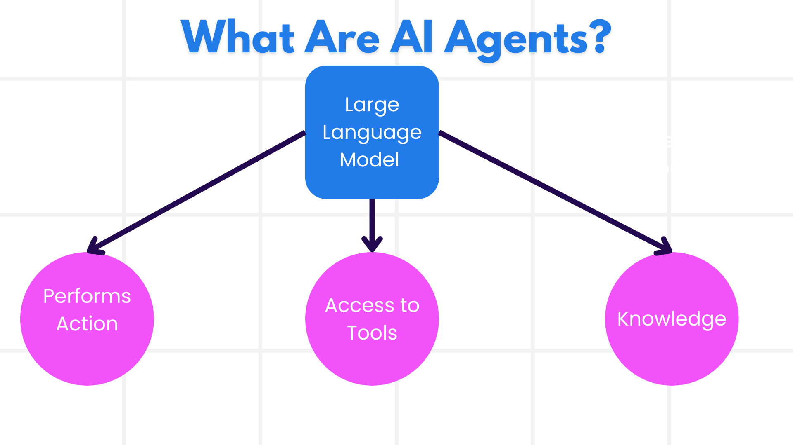
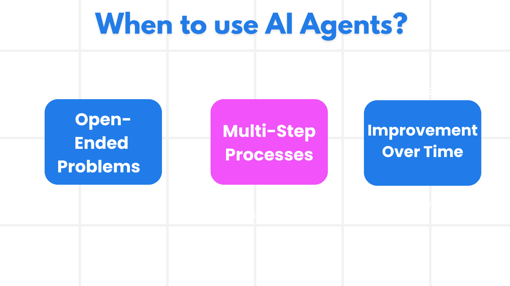

# Introduction to AI Agents and Agent Use Cases

Welcome to the **AI Agents for Beginners** course! This course gives you the foundational knowledge — and real working code — to start building AI Agents from scratch.

Before we jump into building, let's make sure we actually understand what an AI Agent *is* and when it makes sense to use one.

---

## Introduction

This lesson covers:

- What AI Agents are, and the different types that exist
- Which kinds of tasks AI Agents are best suited for
- The core building blocks you'll use when designing an Agentic solution

## Learning Goals

By the end of this lesson, you should be able to:

- Explain what an AI Agent is and how it's different from a regular AI solution
- Know when to reach for an AI Agent (and when not to)
- Sketch out a basic Agentic solution design for a real-world problem

---

## Defining AI Agents and Types of AI Agents

### What are AI Agents?

Here's a simple way to think about it:

> **AI Agents are systems that let Large Language Models (LLMs) actually *do things* — by giving them tools and knowledge to act on the world, not just respond to prompts.**

Let's unpack that a bit:

- **System** — An AI Agent isn't just one thing. It's a collection of parts working together. At its core, every agent has three pieces:
  - **Environment** — The space the agent works in. For a travel booking agent, this would be the booking platform itself.
  - **Sensors** — How the agent reads the current state of its environment. Our travel agent might check hotel availability or flight prices.
  - **Actuators** — How the agent takes action. The travel agent might book a room, send a confirmation, or cancel a reservation.



- **Large Language Models** — Agents existed before LLMs, but LLMs are what make modern agents so powerful. They can understand natural language, reason about context, and turn a vague user request into a concrete plan of action.

- **Perform Actions** — Without an agent system, an LLM just generates text. Inside an agent system, the LLM can actually *execute* steps — searching a database, calling an API, sending a message.

- **Access to Tools** — What tools the agent can use depends on (1) the environment it's running in and (2) what the developer chose to give it. A travel agent might be able to search flights but not edit customer records — it's all about what you wire up.

- **Memory + Knowledge** — Agents can have short-term memory (the current conversation) and long-term memory (a customer database, past interactions). The travel agent might "remember" that you prefer window seats.

---

### The Different Types of AI Agents

Not all agents are built the same. Here's a breakdown of the main types, using a travel booking agent as the running example:

| **Agent Type** | **What It Does** | **Travel Agent Example** |
|---|---|---|
| **Simple Reflex Agents** | Follows hard-coded rules — no memory, no planning. | Sees a complaint email → forwards it to customer service. That's it. |
| **Model-Based Reflex Agents** | Keeps an internal model of the world and updates it as things change. | Tracks historical flight prices and flags routes that are suddenly expensive. |
| **Goal-Based Agents** | Has a goal in mind and figures out how to reach it step by step. | Books a full trip (flights, car, hotel) starting from your current location to get you to your destination. |
| **Utility-Based Agents** | Doesn't just find *a* solution — finds the *best* one by weighing tradeoffs. | Balances cost vs. convenience to find the trip that scores highest for your preferences. |
| **Learning Agents** | Gets better over time by learning from feedback. | Adjusts future booking recommendations based on post-trip survey results. |
| **Hierarchical Agents** | A high-level agent breaks work into subtasks and delegates to lower-level agents. | A "cancel trip" request gets split into: cancel flight, cancel hotel, cancel car rental — each handled by a sub-agent. |
| **Multi-Agent Systems (MAS)** | Multiple independent agents working together (or competing). | Cooperative: separate agents handle hotels, flights, and entertainment. Competitive: multiple agents compete to fill hotel rooms at the best price. |

---

## When to Use AI Agents

Just because you *can* use an AI Agent doesn't mean you always *should*. Here are the situations where agents really shine:



- **Open-Ended Problems** — When the steps to solve a problem can't be pre-programmed. You need the LLM to figure out the path dynamically.
- **Multi-Step Processes** — Tasks that require using tools across several turns, not just a single lookup or generation.
- **Improvement Over Time** — When you want the system to get smarter based on user feedback or environmental signals.

We'll dig deeper into when (and when *not*) to use AI Agents in the **Building Trustworthy AI Agents** lesson later in the course.

---

## Basics of Agentic Solutions

### Agent Development

The first thing you do when building an agent is define *what it can do* — its tools, actions, and behaviors.

In this course we build agents with LangChain and LangGraph on top of any OpenAI-compatible chat model. The model is a pluggable choice: the same code runs against DeepSeek, OpenAI, MiniMax, a local Ollama server or a vLLM deployment by changing three environment variables. An agent combines:

- Models from any provider that exposes an OpenAI-compatible endpoint with tool calling
- Knowledge from your own data sources
- Tools: any Python function exposed as a tool, or a Model Context Protocol server

### Agentic Patterns

You communicate with LLMs through prompts. With agents, you can't always hand-craft every prompt manually — the agent needs to take action across many steps. That's where **Agentic Patterns** come in. They're reusable strategies for prompting and orchestrating LLMs in a more scalable, reliable way.

This course is structured around the most common and useful agentic patterns.

### Agentic Frameworks

Agentic Frameworks give developers ready-made templates, tools, and infrastructure for building agents. They make it easier to:

- Wire up tools and capabilities
- Observe what the agent is doing (and debug when it goes wrong)
- Collaborate across multiple agents

In this course, we focus on LangChain 1.x and LangGraph 1.x (https://docs.langchain.com/oss/python/langchain/overview), open-source frameworks for building production-ready agents.

---

## Code Samples

Ready to see it in action? Here are the code samples for this lesson:

- 🐍 Python: [LangChain agent](./code_samples/01-python-langchain-agent.ipynb)

---

## Assignment: Build Your Own Agent

The notebook above builds a travel agent in four steps: a model client, a tool, an agent, and a streamed reply. Your assignment is to build an agent of your own that follows the same four steps in a **different domain**. Some ideas: a restaurant recommender, a study planner, a movie picker, a gift advisor, a campus help desk. Pick something you can describe in a sentence.

### Requirements

1. **Create a new notebook** in `code_samples/`, named `01-assignment-<your-topic>.ipynb`. Start it with the same setup cell as the lesson notebook, reading `LLM_BASE_URL`, `LLM_API_KEY` and `LLM_MODEL` from `.env`. Never paste an API key into the notebook.
2. **Define at least two tools** with the `@tool` decorator. One should return a list, like `get_destinations`. The other must take at least one argument and use it, for example `get_details(name: str)` or `search(keyword: str)`. Both need type hints and a one-sentence docstring, because the docstring is what the model reads. Hard-coded data is fine.
3. **Create the agent** with `create_agent`. Write a system prompt of your own that says who the agent is, what it helps with, and that it should use the tools instead of guessing.
4. **Run one `invoke` call** and print the *whole* message history, not only the final reply. Loop over `result["messages"]` and print each message's type and content, so the tool call and the tool result are visible.
5. **Run one streamed call** with `astream(..., stream_mode="messages")` for a second question, printing only the chunks that come from the model node, as in the lesson notebook.
6. **Explain each step** in a short markdown cell above it, in your own words. Finish with a markdown cell of three to five sentences: when did the model call a tool, when did it answer without one, and what happened when you asked about something your tools do not cover?

Your notebook must run top to bottom without errors. Check it the same way the course does, from the repository root:

```bash
python scripts/validate_notebooks.py --path 01-intro-to-ai-agents/code_samples/01-assignment-<your-topic>.ipynb
```

### Self-check before you hand it in

- The notebook has no API key, model name or base URL typed into the code.
- The printed message history shows at least one tool call and its result.
- Each tool has type hints and a docstring; the agent's system prompt mentions the tools.
- The streamed reply prints token by token, not as one block at the end.
- The reflection cell answers all three questions.

### Stretch goals (optional)

- Make one tool read its data from a file or a public API instead of a Python list.
- Ask a follow-up question in a second `invoke` call and observe that the agent forgets the first one. Lesson 02 shows how to fix that with a checkpointer.
- Give the agent a question it cannot answer with its tools and adjust the system prompt until it says so honestly instead of inventing an answer.

---

## Got Questions?

Open an issue in this repository with the lesson number and what you tried.


---

## Smoke-Testing This Agent (Optional)

The script [`code_samples/01-serve-travel-agent.py`](./code_samples/01-serve-travel-agent.py) wraps this lesson's `TravelAgent` in a small FastAPI service so it can be checked with the ready-made catalog [`tests/lesson-01-smoke-tests.json`](../tests/lesson-01-smoke-tests.json). Run it from `code_samples/`:

```bash
python 01-serve-travel-agent.py                     # listens on http://127.0.0.1:8000
```

In a second terminal, from the repository root:

```bash
python tests/run_smoke_tests.py tests/lesson-01-smoke-tests.json --url http://localhost:8000
```

The catalog checks that the agent recommends destinations from its tool, surfaces a warm destination for a beach request, and stays on topic instead of writing code. See [`tests/README.md`](../tests/README.md) for the service contract and catalog format.

---

## Previous Lesson

[Course Setup](../00-course-setup/README.md)

## Next Lesson

[Exploring Agentic Frameworks](../02-explore-agentic-frameworks/README.md)
